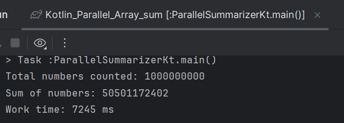
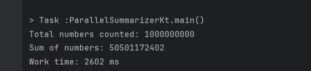
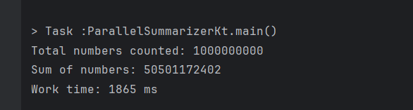
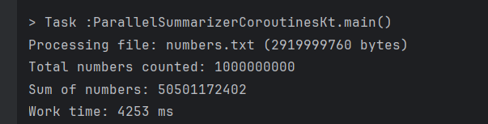
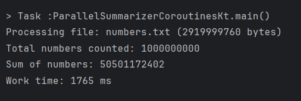
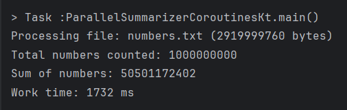

# Kotlin версія: розпаралелювання алгоритму обрахунку суми елементів масиву

## Parallel Summarizer Threads
Багатопоточна версія на базі пулу потоків JVM (`Executors`.`newFixedThreadPool`). Використовує `FileChannel` для незалежного паралельного читання блоків файлу за зміщеннями та повертає підсумки через `Future`.

### Результати роботи
1. 
2. 
3. 

## Parallel Summarizer Coroutines
Асинхронна версія на базі Kotlin Coroutines (`Dispatchers.IO` та `async`). Забезпечує неблокуючий розподіл завдань між процесорними ядрами за принципами структурованої конкурентності (structured concurrency).

### Результати роботи
1. 
2. 
3. 