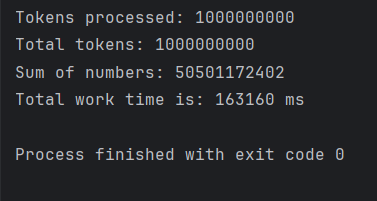
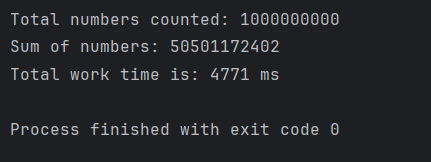
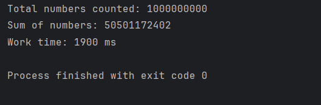
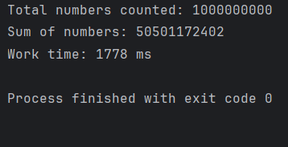

# Java версія: розпаралелювання алгоритму обрахунку суми елементів масиву

## Generator Runnable
Багатопоточний генератор випадкових чисел, який формує числа і записує їх у текстовий файл `numbers.txt`.

## Scanner Summarizer
Однопоточна версія підрахунку суми чисел, що використовує `Scanner` для читання файлу з числами. Створена як еталонний варіант для порівняння часу роботи.

### Результати роботи

## Chunk Summarizer
Оптимізована однопоточна версія підрахунку суми чисел, яка зчитує файл блоками через `FileInputStream` у байтовий буфер.

### Результати роботи

## Parallel Summarizer Main
Багатопоточна оптимізована версія підрахунку суми чисел. Використовує `FileChannel` та `ByteBuffer` для незалежного паралельного читання неперетинних діапазонів файлу та враховує розбиття чисел на межах блоків.

### Результати роботи
1. 
2 

## Summarizer Runnable
Початкова невдала спроба розпаралелювання через інтерфейс `Runnable`, де потоки блокували один одного спільним замком синхронізації та повністю перечитували файл. Була залишена з метою демонстрації помилок конкурентного доступу до I/O.