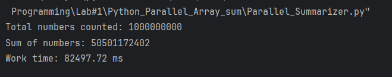
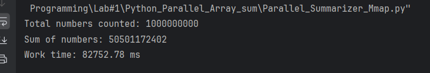
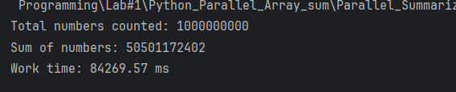

# Python версія: розпаралелювання алгоритму обрахунку суми елементів масиву

## Parallel_Summarizer_Standart
Багатопроцесна версія на базі `ProcessPoolExecutor` для обходу обмежень GIL. Кожен процес відкриває власний дескриптор файлу та зчитує виділений діапазон за допомогою методів `seek()` і `read()`.

### Результати роботи

## Parallel_Summarizer_Mmap
Оптимізована багатопроцесна версія, що використовує `mmap` для відображення файлу в оперативну пам'ять. Дозволяє процесам напряму зрізати байти за індексами без системних викликів читання.

### Результати роботи
1. 
1. 